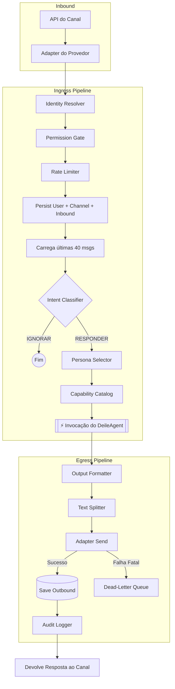

# 🤖 deilebot

> Um runtime unificado e agnóstico de provedor para assistentes de Inteligência Artificial baseados no ecossistema Deile.

O **deilebot** é o componente de execução de ponta que conecta canais de mensageria (Discord, Telegram, WhatsApp, Meta) ao poderoso `DeileAgent`. Ele gerencia nativamente todo o ciclo de vida da mensagem: recepção, permissões, limites de requisição (rate limiting), classificação de intenção (intent) e invocação do cérebro da IA.

---

## 📊 Realidade do Projeto: Matriz de Funcionalidades

Este projeto está em desenvolvimento contínuo. A tabela abaixo reflete **com exatidão o que está efetivamente implementado** e pronto para uso no momento.

| Componente / Feature | Status | Detalhes |
| :--- | :---: | :--- |
| **Provedor: Discord** | 🟢 100% | Totalmente integrado à CLI. Suporta Comandos Slash (Sync), Ferramentas (`pin_message`, `start_thread`, `mention_role`), 7 Cogs, e Job `daily_digest`. |
| **Provedor: Telegram** | 🟡 Base | Adapter criado via `python-telegram-bot` (polling & webhook) mas pendente de amarração para execução na CLI. |
| **Provedor: WhatsApp** | 🟡 Base | Adapter customizado para WhatsApp Cloud API com webhooks implementado, pendente na CLI. |
| **Provedor: Meta (IG/Messenger)** | 🟡 Base | Adapters e endpoints de API estruturados, mas pendente integração de execução na CLI. |
| **Arquitetura Base (Fundação)** | 🟢 100% | Todo o Pipeline Ingress/Egress, Retries, e Arquitetura Agnóstica estão completos. |
| **Persistência & Memória** | 🟢 100% | SQLite para Conversation Store, Histórico, Perfis de Usuário, e Sessões suportado nativamente. |
| **Resiliência (DLQ e Event Bus)** | 🟢 100% | Filas de mensagens mortas (Dead-Letter Queue) para falhas na API e barramento assíncrono interno. |
| **Filtros e Rate Limiting** | 🟢 100% | Classifier de Intenções (poupa chamadas à IA), Role-based Access (Owner/Admin) e Token buckets para Rate Limiting. |

---

## 🧠 Como o Bot chama o "Deile" (Invocação do Agente)

Um dos maiores diferenciais do `deilebot` é que ele **não fala diretamente com as APIs de LLM** (como OpenAI ou Anthropic). O bot age como uma **Ponte e um Classificador Inteligente** que prepara o terreno perfeito antes de invocar o `DeileAgent` — o verdadeiro cérebro da operação.

A comunicação padrão ocorre dentro do próprio processo (modo `in_process`) através de um `InProcessAgentBridge` assíncrono. Existe também um modo alternativo `oneshot_subprocess` que executa o `DeileAgent` em um subprocesso isolado. Veja como funciona o fluxo principal:

```mermaid
sequenceDiagram
    participant User as 👤 Usuário
    participant Bot as 🤖 deilebot (Ingress)
    participant Bridge as 🌉 Agent Bridge
    participant Deile as 🧠 DeileAgent (core)

    User->>Bot: Envia "Abra uma issue para implementar feature X"
    
    rect rgb(30, 41, 59)
    Note right of Bot: 1. Identificação e Persistência (SQLite)
    Note right of Bot: 2. Permissões e Rate Limit
    Note right of Bot: 3. Classificação de Intenção (Devemos responder?)
    Note right of Bot: 4. Seleção da Persona adequada
    Bot->>Bot: Coleta Snapshots das Capabilities do Provedor
    end

    Bot->>Bridge: bridge.invoke(AgentInvocation)
    Note right of Bridge: Envia Histórico, Persona, e Capabilities
    
    Bridge->>Deile: ⚡ agent.process_input(text, session_id, extra_system_prompt, bot_context)
    Note right of Deile: Executa cadeia de raciocínio com tools registradas
    Deile-->>Bridge: response (content, metadata)
    
    Bridge-->>Bot: Retorna Resposta Processada
    Bot->>User: 💬 Renderiza e Envia a Mensagem (Egress)
```



### O que vai na invocação (`AgentInvocation`)?
Quando o `deilebot` invoca o `DeileAgent`, ele não passa apenas um texto. Ele empacota um dataclass `AgentInvocation` com campos ricos:
- **`history`:** As últimas 40 mensagens daquele canal (memória de curto-prazo via SQLite).
- **`capabilities`:** Um `CapabilitySnapshot` que informa ao `DeileAgent` o que ele pode fazer naquele provedor (ex: `can_react=True`, `can_threads=True`, `max_message_chars=2000`).
- **`persona`:** O nome da persona contextual selecionada (ex: `developer`, configurável via `persona_config.yaml`).
- **`bot_user_id`:** Identidade unificada do usuário dentro do bot.
- **`extra_system_prompt`:** Bloco `<bot_capabilities>` renderizado automaticamente pelo `CapabilityCatalog`.
- **`forced_model` / `default_model`:** Lock ou preferência de modelo de LLM definido pelo admin.
- **`inbound_attachments`:** Anexos recebidos na mensagem original.
- **`timeout_seconds`:** Timeout configurável (padrão: 120s, definido em `FoundationSettings`).

---

## 🔄 Fluxo Completo de Vida da Mensagem (Pipeline)

O `deilebot` utiliza uma arquitetura de dutos estritos (Pipelines) para tratar o tráfego que entra (Ingress) e o que sai (Egress).



---

## 🚀 Início Rápido (Quick Start)

### Pré-requisitos
- Python 3.9+
- Git

### Instalação

```bash
# 1. Clone o repositório core
git clone https://github.com/elimarcavalli/deile.git
cd deile

# 2. Clone o repositório do bot para dentro da pasta do core
git clone https://github.com/elimarcavalli/deilebot.git deilebot

# 3. Crie e ative um ambiente virtual
python -m venv .venv
source .venv/bin/activate   # Windows: .venv\Scripts\activate

# 4. Instale as dependências a partir da raiz (core + provedor desejado)
pip install -e ".[discord]"          # Para usar o provedor Discord
# pip install -e ".[all-bots]"       # Para instalar todos os provedores
# pip install -e ".[scheduler]"      # Para usar o agendador de jobs (apscheduler)
```

### Configuração
Crie um arquivo `.env` na raiz do projeto (ou exporte as variáveis no seu terminal) com suas credenciais:

```bash
# Exportando diretamente no terminal (macOS/Linux)
export DEILE_BOT_DISCORD_TOKEN="seu_token_do_discord_aqui"
export OPENAI_API_KEY="sua_chave_openai_aqui"
```

> **⚠️ Importante:** O `deilebot` usa o prefixo `DEILE_BOT_DISCORD_` nativamente para configurações do Discord via variáveis de ambiente. As chaves de LLM (como `OPENAI_API_KEY`) são consumidas pelo `DeileAgent` core.

### Rodando o Bot
No momento atual do projeto, execute usando o provedor do Discord:

```bash
python -m deilebot run --provider discord
```

*(O bot sincronizará automaticamente seus comandos Slash e começará a ouvir as requisições, validando as intenções antes de chamar o `DeileAgent`.)*

---

## 🛠️ Ferramentas da CLI

O ponto de entrada `cli.py` possui utilitários avançados de manutenção:

| Comando | Descrição |
| :--- | :--- |
| `python -m deilebot run --provider discord` | Inicia o runtime de um provedor específico. |
| `python -m deilebot dlq list` | Lista todas as mensagens que falharam repetidamente e estão na Dead-Letter Queue. |
| `python -m deilebot dlq purge --older-than-days 30` | Limpa registros antigos da DLQ. |
| `python -m deilebot sessions list` | Lista todas as sessões armazenadas. |
| `python -m deilebot sessions purge --older-than-days 30` | Limpa sessões inativas do banco de dados. |
| `python -m deilebot metrics` | Printa um snapshot de contadores de métricas (sem runtime ativo, retorna zerado). |
| `python -m deilebot persona list` | Lista todas as personas reconhecidas pelo `PersonaManager`. |
| `python -m deilebot migrate-memory-json --source <path>` | Migra um `memory.json` legado para o SQLite. |

---

## 📁 Arquivos de Configuração

A configuração do bot é feita declarativamente via `YAML` e variáveis de ambiente:

| Arquivo | Propósito |
| :--- | :--- |
| `deile/config/api_config.yaml` | Endpoints de API dos provedores de IA e mapeamentos de modelos. |
| `deile/config/commands.yaml` | Registro de Slash Commands disponíveis. |
| `deile/config/persona_config.yaml` | Regras de seleção de personas (ex: qual persona usar por provedor/canal). |
| `deile/config/system_config.yaml` | Configurações do agente core Deile (auto_discover_tools, max_context_tokens, etc). |
| `config/settings.json` | Configurações locais do runtime (working_directory, log_level, default_model). |
| `.env` | Variáveis de ambiente sensíveis: `DEILE_BOT_DISCORD_TOKEN`, chaves de LLM, etc. *(Ignorado pelo Git)* |

---

## 📄 Licença

Distribuído sob a MIT License.  
Copyright (c) 2026 [@elimarcavalli](https://github.com/elimarcavalli)
