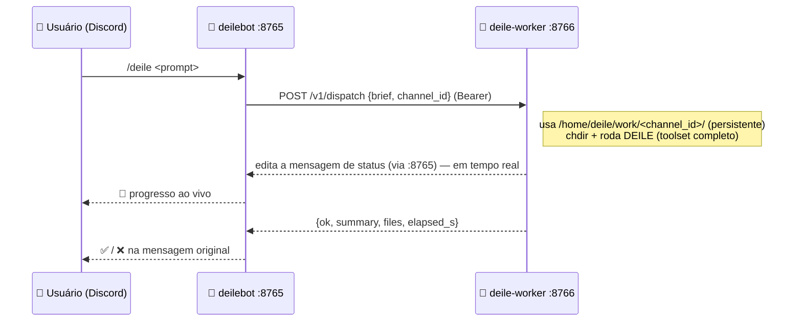
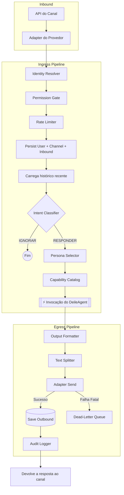

# 🤖 deilebot

> Runtime unificado e agnóstico de provedor para o agente de IA do ecossistema DEILE.

O **deilebot** conecta canais de mensageria (Discord — e, em base, Telegram/WhatsApp/Meta) ao agente **DEILE**. Ele gerencia todo o ciclo de vida da mensagem: recepção, identidade, permissões, rate limiting, classificação de intenção, seleção de persona e invocação do agente.

Este README é a **porta de entrada** do ecossistema: lendo-o do início ao fim você consegue, do zero, colocar o bot e o agente DEILE no ar — localmente ou em container Kubernetes.

---

## 📑 Sumário

1. [Matriz de funcionalidades](#-matriz-de-funcionalidades)
2. [Começar do zero](#-começar-do-zero) — pré-requisitos, instalação, criar o bot, configurar, rodar
3. [Configuração manual](#-configuração-manual) — alternativa ao wizard
4. [Deploy em Kubernetes](#-deploy-em-kubernetes)
5. [O DEILE worker](#-o-deile-worker)
6. [Como o bot invoca o agente](#-como-o-bot-invoca-o-agente)
7. [Fluxo de vida da mensagem](#-fluxo-de-vida-da-mensagem)
8. [Comandos slash do Discord](#-comandos-slash-do-discord)
9. [Login GitHub](#-login-github-githublogin)
10. [Ferramentas da CLI](#-ferramentas-da-cli)
11. [Arquivos de configuração](#-arquivos-de-configuração)

---

## 📊 Matriz de funcionalidades

A tabela reflete **o que está efetivamente implementado**.

| Componente / Feature | Status | Detalhes |
| :--- | :---: | :--- |
| **Provedor: Discord** | 🟢 100% | Integrado à CLI. Comandos slash (sync automático), **13 cogs**, ferramentas de mensageria, job `daily_digest`. |
| **Provedor: Telegram** | 🟡 Base | Adapter via `python-telegram-bot` criado; a CLI ainda só executa `discord`. |
| **Provedor: WhatsApp** | 🟡 Base | Adapter + webhooks (WhatsApp Cloud API) implementados; não amarrado na CLI. |
| **Provedor: Meta (IG/Messenger)** | 🟡 Base | Adapters e endpoints de API estruturados; não amarrados na CLI. |
| **Wizard de instalação** | 🟢 100% | `deilebot setup` — configuração interativa do zero (local ou container). |
| **Login forge via Discord** | 🟢 100% | Grupo `/git` (login/status/logout/ideia) — GitHub (PAT + OAuth device flow) + GitLab (PAT). **Breaking:** `/github_*` removidos. |
| **Pipeline Ingress/Egress** | 🟢 100% | Identidade, permissões, rate limit, intent, persona, capabilities, formatação, retries. |
| **Persistência & memória** | 🟢 100% | SQLite para conversas, histórico, perfis de usuário e sessões. |
| **Resiliência (DLQ + Event Bus)** | 🟢 100% | Dead-Letter Queue para falhas de API + barramento assíncrono interno. |
| **Control plane HTTP** | 🟢 100% | API Bearer-auth (a "flecha reversa" agente→bot): DM outbound, `/v1/test/simulate`, health. |
| **Deploy em Kubernetes** | 🟢 100% | Stack containerizada — bot + **deile-worker** + deile-shell. Ver [Deploy em Kubernetes](#-deploy-em-kubernetes). |

---

## 🚀 Começar do zero

O caminho mais rápido: clonar, instalar e rodar **`deilebot setup`** — um assistente interativo que pergunta tudo, valida o token do Discord ao vivo e grava a configuração.

### Pré-requisitos

- **Python 3.9+** e **Git**.
- Uma conta no Discord (para criar o bot).
- Pelo menos uma chave de API de LLM: Anthropic, OpenAI, DeepSeek **ou** Google.
- *(Só para o modo container)* Kubernetes — o `infra/setup_environment.py` instala o que faltar (k3s no Linux, colima no macOS); ou use um Rancher Desktop já instalado.

### Passo 1 — Clonar os repositórios

O ecossistema são **dois repositórios**: `deile` (o agente core) e `deilebot` (este — o bot). O `deilebot` é clonado **para dentro** da pasta do `deile`, com o nome `deilebot/`.

```bash
# o agente DEILE (core)
git clone https://github.com/elimarcavalli/deile.git
cd deile

# o bot, clonado PARA DENTRO de deile/, como `deilebot/`
git clone https://github.com/elimarcavalli/deilebot.git deilebot
```

### Passo 2 — Instalar

```bash
# ambiente virtual (a partir da raiz `deile/`)
python3 -m venv .venv
source .venv/bin/activate          # Windows: .venv\Scripts\activate

# instale o agente core e o bot
pip install -e .                        # o agente DEILE
pip install -e "./deilebot[discord]"    # o bot + a biblioteca discord.py
```

> **Por que dois `pip install`?** O `deilebot` usa o `DeileAgent` do core em processo, então ambos precisam estar instalados. O extra `[discord]` é o que puxa a biblioteca `discord.py`.
>
> **Sempre rode o bot a partir da raiz `deile/`** — rodar de dentro de `deilebot/` faz o pacote `deile.config` ser sombreado por overrides parciais e o bot quebra.
>
> **Atalho:** em vez dos passos manuais acima, `python3 infra/setup_environment.py` instala tudo — e, se for usar o modo container, detecta/instala o Kubernetes (k3s no Linux, colima no macOS). Rode `--check` para só diagnosticar.

### Passo 3 — Criar o bot no Discord

O wizard **guia** este passo, mas o Discord não tem API para criar a aplicação — isto é manual:

1. Abra o **[Discord Developer Portal](https://discord.com/developers/applications)**.
2. **New Application** → dê um nome → **Create**.
3. No menu lateral, vá em **Bot**.
4. Em **Privileged Gateway Intents**, **LIGUE** os dois:
   - **MESSAGE CONTENT INTENT** (sem ele o bot não enxerga o texto das mensagens);
   - **SERVER MEMBERS INTENT**.
5. Clique em **Reset Token** e **copie o token** (você vai colá-lo no wizard).

> O token é o segredo do bot. Nunca o exponha em commits, logs ou no chat. O wizard pede o token sem ecoá-lo no terminal.

Para **adicionar o bot ao seu servidor**, o wizard imprime uma URL de convite pronta logo após validar o token. (Você também pode montá-la em **OAuth2 → URL Generator** no portal, com os escopos `bot` + `applications.commands`.)

### Passo 4 — Configurar (o wizard `deilebot setup`)

```bash
python -m deilebot setup
```

O assistente pergunta, em sequência:

1. **Modo** — `local` (no host) ou `container` (Kubernetes).
2. **Token do bot** — você cola o token; o wizard **valida ao vivo** na API do Discord, mostra o nome do bot e imprime a **URL de convite**.
3. **Dono** — seu Discord User ID (quem pode usar comandos owner-only). Para descobrir: Discord → Configurações → Avançado → ative **Modo desenvolvedor**; clique com o botão direito no seu nome → **Copiar ID do usuário**.
4. **Provedor de LLM** — escolha um (Anthropic/OpenAI/DeepSeek/Google) e cole a chave.
5. **Control plane** — o token de autenticação é **gerado automaticamente**.
6. **Login GitHub** (opcional) — Client ID de um OAuth App, se você tiver; pode pular.

Ao final, o wizard grava:

- **Modo local:** `.env` (segredos) + `config/deilebot.yaml` (estrutura) na raiz `deile/`.
- **Modo container:** o `.env`, ajusta os donos no `infra/k8s/manifests/15-bot-config.yaml`, grava `.deile/deploy.json` e, com sua confirmação, **builda a imagem e faz o deploy** no Kubernetes (`deploy.py k8s build` + `deploy.py k8s up`).

> **Primeira execução sem config:** se você rodar `python -m deilebot run --provider discord` sem nenhuma configuração, o bot detecta a ausência do token e **abre o wizard automaticamente** (quando há um terminal interativo).
>
> **Re-execução:** `deilebot setup --reconfigure` reconfigura mesmo com config já existente. `--mode local|container` pula a pergunta do modo.
>
> O wizard **não** cria a aplicação no Discord nem instala o Kubernetes — ele guia esses passos e valida o que você fornece.

### Passo 5 — Rodar

**Modo local:**

```bash
python -m deilebot run --provider discord
```

O bot sincroniza os comandos slash automaticamente e passa a ouvir. **Modo container:** o deploy já foi feito pelo wizard no Passo 4 — confira com `kubectl -n deile get pods`.

---

## 🔧 Configuração manual

Alternativa ao wizard, para quem prefere editar os arquivos à mão. Há dois arquivos, ambos na **raiz `deile/`** (de onde o bot é executado):

| Arquivo | Conteúdo | Template |
| :--- | :--- | :--- |
| `.env` | Segredos: token do Discord, chaves de LLM, tokens do control plane. *(Ignorado pelo Git.)* | [`deilebot/.env.example`](.env.example) |
| `config/deilebot.yaml` | Estrutura não-secreta: `foundation`, `permissions` (donos), `personas`, `github`, `git_integration`. | [`deilebot/config/deilebot.example.yaml`](config/deilebot.example.yaml) |

```bash
# a partir da raiz `deile/`
cp deilebot/.env.example .env
cp deilebot/config/deilebot.example.yaml config/deilebot.yaml
# edite os dois e preencha os valores
```

O `.env` é um arquivo `chave=valor` simples (sem `export`), lido pelo `python-dotenv`. O bot usa o prefixo `DEILE_BOT_` para configurações por variável de ambiente; as chaves de LLM (ex.: `OPENAI_API_KEY`) são consumidas pelo agente DEILE core. Se o `config/deilebot.yaml` estiver ausente, o bot usa os defaults.

---

## ☸️ Deploy em Kubernetes

Em produção o deilebot roda numa stack containerizada (namespace `deile`, imagem `deile-stack:local`). Os manifestos e o script de orquestração (`run.sh`) vivem em **`infra/k8s/` no repositório `deile`** (não neste).

O modo container do wizard automatiza tudo abaixo; esta seção explica o que acontece por baixo.

### Entrypoint: `wrapper.py`

Todo container roda `python3 /app/wrapper.py <papel>`. O wrapper:

- Lê segredos como **arquivos** em `/run/secrets/<papel>/` — nunca como variáveis de ambiente (evita que o segredo fique gravado em `/proc/<pid>/environ`). As chaves de LLM são removidas de `os.environ` após o bootstrap.
- Configura credenciais git (`~/.git-credentials`, modo 0600) e o guard de `git clone`, que aplica a allowlist `git_integration.clonable_repos`.
- Aplica o **tool whitelist** quando o papel recebe prompt não-confiável.

Papéis suportados: **`bot`** (executa `deilebot.cli`), **`deile`** (executa `deile.cli`) e **`worker`** (executa o `worker_server`).

### Pods

| Pod / Workload | Comando | Função |
| :--- | :--- | :--- |
| `deilebot` | `wrapper.py bot run --provider discord` | Daemon do Discord + control plane HTTP (`:8765`). Agente embarcado restrito a ferramentas de mensageria. |
| `deile-worker` | `wrapper.py worker` | Worker isolado que executa o trabalho pesado despachado pelo `/deile` (`:8766`). Toolset completo. Ver [O DEILE worker](#-o-deile-worker). |
| `deile-shell` | `wrapper.py deile` (sob demanda, via `kubectl exec`) | Shell interativo do operador, com toolset completo. |
| `deile-oneshot` | `wrapper.py deile` (Job) | Execução pontual, one-shot, do `deile`. |

### O orquestrador `deploy.py`

A stack é gerida pelo `infra/k8s/deploy.py` (o antigo `run.sh` virou um shim de compatibilidade que apenas chama este script). O alvo é **sempre explícito no verbo** — `k8s` (stack no Kubernetes) ou `local` (bot como serviço no host) — e rodar sem argumentos abre um menu interativo que detecta o estado de cada alvo:

```bash
python3 infra/k8s/deploy.py            # menu interativo (detecta o estado de cada alvo)
python3 infra/k8s/deploy.py help       # lista todos os comandos
python3 infra/k8s/deploy.py doctor     # diagnostica os pré-requisitos da máquina

# alvo k8s — a stack no Kubernetes
python3 infra/k8s/deploy.py k8s up        # sobe/atualiza a stack (namespace, Secrets, deployments)
python3 infra/k8s/deploy.py k8s build     # builda a imagem deile-stack:local (--restart religa os pods)
python3 infra/k8s/deploy.py k8s status    # pods, deployments e services
python3 infra/k8s/deploy.py k8s logs      # logs recentes de bot + worker
python3 infra/k8s/deploy.py k8s restart   # rollout restart
python3 infra/k8s/deploy.py k8s start     # religa o bot (scale → 1)
python3 infra/k8s/deploy.py k8s stop      # pausa o bot (scale → 0; mantém dados e Secrets)
python3 infra/k8s/deploy.py k8s test      # roda o Job one-shot deile-oneshot
python3 infra/k8s/deploy.py k8s clone <owner/repo>   # clona um repo no deile-shell
python3 infra/k8s/deploy.py k8s down      # teardown completo — APAGA o namespace e os dados

# alvo local — o bot como serviço no host (sem k8s)
python3 infra/k8s/deploy.py local start   # sobe o bot como serviço (systemd/launchd/pidfile)
python3 infra/k8s/deploy.py local status  # estado do serviço
python3 infra/k8s/deploy.py local stop    # para o bot
python3 infra/k8s/deploy.py local restart # reinicia o bot
python3 infra/k8s/deploy.py local logs    # logs recentes do bot

# qualquer comando que ALTERA estado aceita --dry-run (mostra o plano e sai)
python3 infra/k8s/deploy.py --dry-run k8s up
```

O `deploy.py` lê os segredos do **`.env` na raiz do repo `deile`** e os injeta nos Secrets do cluster — nada de segredo é impresso. Antes de operar, ele checa os pré-requisitos; se faltar Kubernetes, chama o `infra/setup_environment.py`. Não há mais adivinhação de alvo — `k8s` e `local` são sempre explícitos. Comandos antigos (`up`, `start`, ...) ainda funcionam, mas avisam a forma nova; o antigo `reset` saiu — use `k8s down` + `k8s up` (ou `local restart`).

### Control plane — a "flecha reversa"

O `deilebot` expõe uma API HTTP Bearer-auth em `:8765`. É por ela que o agente DEILE (e o worker) falam de volta com o bot — enviar DM (`/v1/outbound/discord/dm.send`), editar mensagens de status, simular um inbound para testes (`/v1/test/simulate`), health.

---

## 🧠 O DEILE worker

O `deile-worker` é um pod separado, de vida longa, que executa **trabalho de desenvolvimento de verdade** despachado pelo bot. Enquanto o agente embarcado no pod `deilebot` é restrito a ferramentas de mensageria — não tem `bash`/`git`/arquivos, porque recebe input não-confiável do Discord —, o worker tem o **toolset completo**.

### Como funciona o despacho



1. Usuário no Discord: `/deile <prompt>`.
2. O agente embarcado do bot chama a ferramenta `dispatch_deile_task`.
3. Ela faz `POST` para `http://deile-worker:8766/v1/dispatch` (Bearer token, payload `{brief, channel_id, …}`).
4. O worker usa um diretório de trabalho **persistente por canal/usuário** (`/home/deile/work/<channel_id>/` — numa DM o canal é exclusivo do usuário, então equivale à pasta dele), muda o CWD para lá e roda o DEILE com toolset completo. O mesmo canal/usuário sempre reusa a mesma pasta; contextos diferentes ficam isolados.
5. Conforme trabalha, o worker **edita uma mensagem de status no Discord em tempo real** (chamando de volta o control plane do bot em `:8765`).
6. Ao terminar, devolve `{ok, summary, files, elapsed_s}` e marca a mensagem do usuário com ✅/❌.

### Isolamento (defesa em profundidade)

- Cada canal/usuário tem seu diretório de trabalho persistente; o CWD do agente é travado nele (um não enxerga o do outro); concorrência limitada a 1 task por vez.
- O worker tem o toolset cheio, **mas** um *negative whitelist* remove as ferramentas de mensageria e o próprio `dispatch_deile_task` (evita recursão infinita e abuso para enviar DM/phishing).
- Um *prompt envelope* imutável envolve o brief do usuário, instruindo o agente a tratá-lo como **dado**, não como instrução para alterar as regras.
- Pod hardening: `uid 10001`, `readOnlyRootFilesystem`, `drop ALL caps`, NetworkPolicy (ingress só do `deilebot`; egress só 443 + bot:8765 — Mac/LAN inalcançáveis).
- Timeout de 10 min por task (`DEILE_WORKER_TASK_TIMEOUT_S`).

### O que o worker precisa

- Uma chave de LLM (montada como arquivo em `/run/secrets/deile/`).
- O bearer token compartilhado (Secret `worker-bearer`, em `/run/secrets/worker/AUTH_TOKEN`) — o **mesmo** token é espelhado no pod `deilebot` para ele autenticar o dispatch.
- `DEILE_BOT_ENDPOINT` apontando para o control plane do bot (para postar/editar as mensagens de status).
- O bot precisa de `DEILE_WORKER_ENDPOINT` apontando para `http://deile-worker:8766`.

Tudo isso é amarrado automaticamente pelo `run.sh up` (e pelo wizard no modo container).

> **No modo local** o worker é um conceito de container. O agente embarcado do bot responde o chat normal; `/deile` para trabalho pesado isolado depende do worker — rode o `worker_server` à parte e aponte `DEILE_WORKER_ENDPOINT` para ele, ou use o modo container.

---

## 🌉 Como o bot invoca o agente

O `deilebot` **não fala diretamente com as APIs de LLM**. Ele age como ponte e classificador: prepara o contexto e então invoca o `DeileAgent`.

A comunicação padrão ocorre dentro do próprio processo (`agent_bridge_mode: in_process`) através de um `InProcessAgentBridge`. Existe também o modo `oneshot_subprocess`, que executa o `DeileAgent` num subprocesso isolado.

> **Importante (deploy em K8s):** no pod `deilebot`, o agente embarcado é restrito por um **tool whitelist** às ferramentas de mensageria — ele **não** tem `bash`/`git`/ferramentas de arquivo. Trabalho de agente com toolset completo só acontece via `/deile`, que despacha para o `deile-worker` isolado.



```mermaid
sequenceDiagram
    participant User as 👤 Usuário
    participant Bot as 🤖 deilebot (Ingress)
    participant Bridge as 🌉 Agent Bridge
    participant Deile as 🧠 DeileAgent (core)

    User->>Bot: Envia uma mensagem

    rect rgb(30, 41, 59)
    Note right of Bot: 1. Identificação e Persistência (SQLite)
    Note right of Bot: 2. Permissões e Rate Limit
    Note right of Bot: 3. Classificação de Intenção (devemos responder?)
    Note right of Bot: 4. Seleção da Persona adequada
    Bot->>Bot: Coleta snapshots das Capabilities do provedor
    end

    Bot->>Bridge: bridge.invoke(AgentInvocation)
    Bridge->>Deile: ⚡ agent.process_input(text, session_id, extra_system_prompt, bot_context)
    Deile-->>Bridge: response (content, metadata)
    Bridge-->>Bot: Retorna a resposta processada
    Bot->>User: 💬 Renderiza e envia a mensagem (Egress)
```

### O que vai na invocação (`AgentInvocation`)

- **`history`:** as últimas mensagens daquele canal (memória de curto prazo via SQLite).
- **`capabilities`:** um `CapabilitySnapshot` (`can_react`, `can_threads`, `max_message_chars`, …).
- **`persona`:** a persona contextual selecionada (ex.: `developer`).
- **`bot_user_id`:** identidade unificada do usuário.
- **`extra_system_prompt`:** bloco `<bot_capabilities>` renderizado pelo `CapabilityCatalog`.
- **`forced_model` / `default_model`:** lock ou preferência de modelo de LLM.
- **`inbound_attachments`:** anexos da mensagem.
- **`timeout_seconds`:** timeout configurável (padrão 120s em `FoundationSettings`).

---

## 🔄 Fluxo de vida da mensagem



---

## 💬 Comandos slash do Discord

Cada cog registra seus comandos; o sync com o Discord é automático no `on_ready`.

| Comando | Cog | Descrição |
| :--- | :--- | :--- |
| `/ping` | ping | Latência do bot. |
| `/help` | help | Ajuda e lista de comandos. |
| `/capabilities` | capabilities | Capacidades do provedor atual. |
| `/status` | status | Saúde do bot, worker e modelo. |
| `/deile <prompt>` | agent | Despacha a tarefa para o `deile-worker` isolado (sujeito ao safety gate). |
| `/git login` | git | Autentica o bot num forge: **GitHub** (PAT ou OAuth) ou **GitLab** (PAT). Owner-only. |
| `/git status` | git | Status de autenticação de cada forge (revalidado ao vivo, 3 estados). Owner-only. |
| `/git logout [forge]` | git | Remove credencial de um forge (ou de ambos). Owner-only. |
| `/git ideia <texto>` | git | Submete uma ideia → abre uma issue INTENT no forge configurado. |
| `/historico`, `/historico_users`, `/historico_canais`, `/historico_export`, `/memoria` | history | Consulta de histórico e memória. |
| `/agendar`, `/agendamentos`, `/cancelar` | cron | Agendamento de tarefas em linguagem natural. |
| `/forget_me` | privacy | Apaga todo o histórico e memória do próprio usuário (self-service). |
| `/dlq`, `/forget`, `/sessions`, `/metrics`, `/audit` | admin | Operações de owner (DLQ, privacidade, sessões, métricas, auditoria). |

> ⚠️ **Breaking change (V1):** `/github_login`, `/github_status` e `/github_logout` foram **removidos** e substituídos pelo grupo `/git`. Tentar os comandos antigos retorna uma mensagem de migração.

### 🔐 Login forge (`/git login`)

Autentica o git do bot num forge. **Owner-only.** Abre um modal com dois campos:

- **Forge** — `github` ou `gitlab`
- **Personal Access Token** — cole o PAT (GitHub: `ghp_…`/`github_pat_…`; GitLab: `glpat-…`/`glsoat-…`)

O token é **validado ao vivo** antes de ser gravado — um PAT inválido nunca chega ao disco.

#### Login GitHub (via `/git login`)

- Forge=`github`, cole o PAT clássico (`ghp_`) ou fine-grained (`github_pat_`).
- Método OAuth device flow (RFC 8628) disponível apenas via código (V1).
- Exige `forge.github.oauth_client_id` no `deilebot.yaml` para usar OAuth.

#### Login GitLab (via `/git login`)

- Forge=`gitlab`, cole o PAT pessoal (`glpat-`) ou service account (`glsoat-`).
- OAuth GitLab é roadmap (V3) — use PAT em V1.
- Self-hosted: configure `forge.gitlab.host` no `deilebot.yaml`.
- **Pré-requisito de NetworkPolicy:** para self-hosted, libere o egress para o host do GitLab na NetworkPolicy do Kubernetes (`default-deny` bloqueia conexões externas por padrão).

#### `/git status` — 3 estados por forge

| Estado | Significado |
| :--- | :--- |
| ✅ válido | Token presente e `GET /user` retorna 200 |
| ⚠️ inválido | Token presente mas `GET /user` retorna 401 (botão "Reautenticar") |
| ⛔ não configurado | Sem token gravado |

O token é instalado em `~/.git-credentials` (modo 0600), **uma linha por host** — GitHub e GitLab coexistem no mesmo arquivo. Metadados não-sensíveis em `~/.deile/forge_auth.json` (chaves `github` e `gitlab`). O token nunca vai para variável de ambiente, argv ou conversation store.

---

## 🛠️ Ferramentas da CLI

O ponto de entrada `deilebot.cli` expõe:

| Comando | Descrição |
| :--- | :--- |
| `python -m deilebot setup` | **Wizard de configuração interativa** (`--mode local\|container`, `--reconfigure`). |
| `python -m deilebot run --provider discord` | Inicia o runtime de um provedor. |
| `python -m deilebot dlq list` | Lista mensagens na Dead-Letter Queue. |
| `python -m deilebot dlq purge --older-than-days 30` | Limpa registros antigos da DLQ. |
| `python -m deilebot sessions list` | Lista as sessões armazenadas. |
| `python -m deilebot sessions purge --older-than-days 30` | Limpa sessões inativas. |
| `python -m deilebot metrics` | Snapshot de métricas (sem runtime ativo, retorna zerado). |
| `python -m deilebot persona list` | Lista as personas reconhecidas pelo `PersonaManager`. |
| `python -m deilebot migrate-memory-json --source <path>` | Migra um `memory.json` legado para o SQLite. |

---

## 📁 Arquivos de configuração

| Arquivo | Local | Propósito |
| :--- | :--- | :--- |
| `.env` | raiz `deile/` | Segredos: `DEILE_BOT_DISCORD_TOKEN`, chaves de LLM, tokens de control plane. *(Ignorado pelo Git.)* |
| `config/deilebot.yaml` | raiz `deile/` | Runtime não-secreto (`foundation`, `permissions`, `personas`, `github`, `git_integration`). Se ausente, usa defaults. |
| `.env.example` | `deilebot/` | Template do `.env`. |
| `config/deilebot.example.yaml` | `deilebot/config/` | Template do `config/deilebot.yaml`. |

> Os arquivos `api_config.yaml`, `commands.yaml`, `persona_config.yaml` e `system_config.yaml` pertencem ao repositório [`elimarcavalli/deile`](https://github.com/elimarcavalli/deile) (agente core), não ao `deilebot`.

---

## 🎙️ Engine de Transcrição Local (GPU toggle)

O bot suporta transcrição offline via `faster-whisper` (CTranslate2).

### Config

```yaml
# config/deilebot.yaml
transcription:
  engine: local
  local_model_path: /path/to/ctranslate2-model   # diretório com model.bin
  local_device: cpu        # cpu (default) | cuda (GPU)
  local_compute_type: int8 # int8 (CPU) | float16 (GPU recomendado)
  local_cuda_fallback: fail # fail (default) | cpu (fallback automático)
  local_timeout_seconds: 60
```

### Toggle GPU

| `local_device` | `local_cuda_fallback` | CUDA disponível? | Resultado |
|----------------|-----------------------|-----------------|-----------|
| `cpu`          | qualquer              | N/A             | CPU       |
| `cuda`         | `fail` (default)      | sim             | CUDA      |
| `cuda`         | `fail` (default)      | não             | Erro: "CUDA indisponível" |
| `cuda`         | `cpu`                 | não             | Fallback CPU + WARN no log |

O log confirma o device efetivamente usado:
```json
{"level": "info", "msg": "local model loaded", "device": "cpu"}
```

### Smoke test de GPU (manual — sem runner CI)

Antes de deploy em produção com GPU, execute em nó com GPU:

- [ ] `local_device: cuda`, `local_cuda_fallback: fail` → log `device=cuda` em `local model loaded`
- [ ] Transcreve clipe de referência com resultado correto
- [ ] Altera para `local_device: cpu` → log `device=cpu`
- [ ] Com CUDA desabilitada e `local_cuda_fallback: fail` → erro explícito "CUDA indisponível"
- [ ] Com CUDA desabilitada e `local_cuda_fallback: cpu` → WARN `device_fallback=cuda->cpu`, transcrição segue

> **Deploy K8s com GPU** (resource limits, nodeSelector, tolerations, imagem CUDA) vive em
> `infra/k8s/` no repositório `deile` — não neste (ver `README.md:165`).

### SLO de latência

Ver `docs/transcription-local-slo.md`. O benchmark RTF roda local via
`scripts/bench_transcription_local.py` (fora do CI).

---

## 📄 Licença

Distribuído sob a MIT License.
Copyright (c) 2026 [@elimarcavalli](https://github.com/elimarcavalli)
