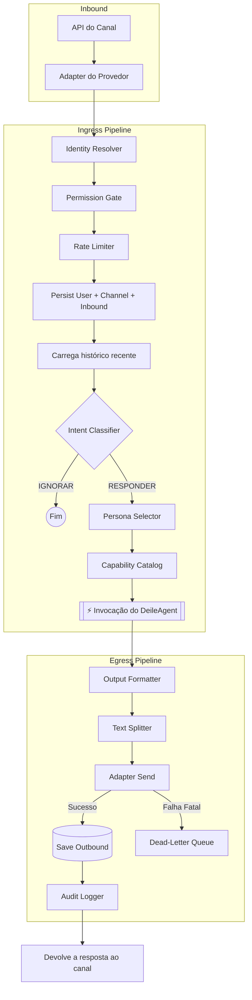

# 🤖 deilebot

> Runtime unificado e agnóstico de provedor para o agente de IA do ecossistema DEILE.

O **deilebot** conecta canais de mensageria (Discord — e, em base, Telegram/WhatsApp/Meta) ao `DeileAgent`. Ele gerencia todo o ciclo de vida da mensagem: recepção, identidade, permissões, rate limiting, classificação de intenção, seleção de persona e invocação do agente.

---

## 📊 Matriz de funcionalidades

A tabela reflete **o que está efetivamente implementado**.

| Componente / Feature | Status | Detalhes |
| :--- | :---: | :--- |
| **Provedor: Discord** | 🟢 100% | Integrado à CLI. Comandos slash (sync automático), **13 cogs**, ferramentas de mensageria (`pin_message`, `start_thread`, `mention_role`), job `daily_digest`. |
| **Provedor: Telegram** | 🟡 Base | Adapter via `python-telegram-bot` criado; `cli.py run` ainda só executa `discord` (os demais retornam "not yet wired"). |
| **Provedor: WhatsApp** | 🟡 Base | Adapter + webhooks (WhatsApp Cloud API) implementados; não amarrado na CLI. |
| **Provedor: Meta (IG/Messenger)** | 🟡 Base | Adapters e endpoints de API estruturados; não amarrados na CLI. |
| **Login GitHub via Discord** | 🟢 100% | `/github_login` (PAT ou OAuth device flow), `/github_status`, `/github_logout` — owner-only. |
| **Pipeline Ingress/Egress** | 🟢 100% | Identidade, permissões, rate limit, intent, persona, capabilities, formatação, retries. |
| **Persistência & memória** | 🟢 100% | SQLite para conversas, histórico, perfis de usuário e sessões. |
| **Resiliência (DLQ + Event Bus)** | 🟢 100% | Dead-Letter Queue para falhas de API + barramento assíncrono interno. |
| **Control plane HTTP** | 🟢 100% | API Bearer-auth (a "flecha reversa" agente→bot): DM outbound, `/v1/test/simulate`, health. |
| **Deploy em Kubernetes** | 🟢 Bot + shell | Stack containerizada — ver a seção [Deploy em Kubernetes](#-deploy-em-kubernetes). |

---

## 🧠 Como o bot invoca o agente

O `deilebot` **não fala diretamente com as APIs de LLM**. Ele age como ponte e classificador: prepara o contexto e então invoca o `DeileAgent`.

A comunicação padrão ocorre dentro do próprio processo (`agent_bridge_mode: in_process`) através de um `InProcessAgentBridge`. Existe também o modo `oneshot_subprocess`, que executa o `DeileAgent` num subprocesso isolado.

> **Importante (deploy em K8s):** no pod `deilebot`, o agente embarcado é restrito por um **tool whitelist** às ferramentas de mensageria (`discord_send_message`, `discord_send_dm`, …) — ele **não** tem `bash`/`git`/ferramentas de arquivo. Trabalho de agente com toolset completo só acontece via `/deile`, que despacha para um worker isolado (ver a seção K8s).

```mermaid
sequenceDiagram
    participant User as 👤 Usuário
    participant Bot as 🤖 deilebot (Ingress)
    participant Bridge as 🌉 Agent Bridge
    participant Deile as 🧠 DeileAgent (core)

    User->>Bot: Envia uma mensagem

    rect rgb(30, 41, 59)
    Note right of Bot: 1. Identificação e Persistência (SQLite)
    Note right of Bot: 2. Permissões e Rate Limit
    Note right of Bot: 3. Classificação de Intenção (devemos responder?)
    Note right of Bot: 4. Seleção da Persona adequada
    Bot->>Bot: Coleta snapshots das Capabilities do provedor
    end

    Bot->>Bridge: bridge.invoke(AgentInvocation)
    Bridge->>Deile: ⚡ agent.process_input(text, session_id, extra_system_prompt, bot_context)
    Deile-->>Bridge: response (content, metadata)
    Bridge-->>Bot: Retorna a resposta processada
    Bot->>User: 💬 Renderiza e envia a mensagem (Egress)
```



### O que vai na invocação (`AgentInvocation`)
- **`history`:** as últimas mensagens daquele canal (memória de curto prazo via SQLite).
- **`capabilities`:** um `CapabilitySnapshot` (`can_react`, `can_threads`, `max_message_chars`, …).
- **`persona`:** a persona contextual selecionada (ex.: `developer`).
- **`bot_user_id`:** identidade unificada do usuário.
- **`extra_system_prompt`:** bloco `<bot_capabilities>` renderizado pelo `CapabilityCatalog`.
- **`forced_model` / `default_model`:** lock ou preferência de modelo de LLM.
- **`inbound_attachments`:** anexos da mensagem.
- **`timeout_seconds`:** timeout configurável (padrão 120s em `FoundationSettings`).

---

## ☸️ Deploy em Kubernetes

Em produção o deilebot roda numa stack containerizada (namespace `deile`, imagem `deile-stack:local`). Os manifestos e o script de orquestração (`run.sh`) vivem em `infra/k8s/` **no repositório `deile`** (não neste).

### Entrypoint: `wrapper.py`

Todo container roda `python3 /app/wrapper.py <papel>`. O wrapper:
- Lê segredos como **arquivos** em `/run/secrets/<papel>/` — nunca como variáveis de ambiente (evita que o segredo fique gravado em `/proc/<pid>/environ`). As chaves de LLM são removidas de `os.environ` após o bootstrap.
- Configura credenciais git (`~/.git-credentials`, modo 0600) e o guard de `git clone`, que aplica a allowlist `git_integration.clonable_repos`.
- Aplica o **tool whitelist** (só ferramentas de mensageria) quando o papel recebe prompt não-confiável.

Papéis suportados na `main`: **`bot`** (executa `deilebot.cli`) e **`deile`** (executa `deile.cli`).

### Pods

| Pod | Comando | Função |
| :--- | :--- | :--- |
| `deilebot` | `wrapper.py bot` | Daemon do Discord + control plane HTTP (`:8765`). Agente embarcado restrito a ferramentas de mensageria. |
| `deile-shell` | `wrapper.py deile` (sob demanda, via `kubectl exec`) | Shell interativo do operador, com toolset completo. |

Há ainda um Job one-shot (`deile-oneshot`) para execuções pontuais do `deile`.

### Control plane — a "flecha reversa"

O `deilebot` expõe uma API HTTP Bearer-auth em `:8765` (habilitada quando `DEILE_BOT_CONTROL_PLANE_AUTH_TOKEN` está definido). É por ela que o agente DEILE fala de volta com o bot — enviar DM (`/v1/outbound/discord/dm.send`), simular um inbound para testes (`/v1/test/simulate`), health.

### Despacho `/deile` → worker isolado

O comando `/deile` despacha a tarefa, via `DispatchDeileTaskTool`, para um **worker DEILE isolado** (pod separado, toolset completo, filesystem próprio).

> **Estado atual:** o subsistema worker (`deile-worker`, `infra/k8s/worker_server.py`, `deile/tools/dispatch_deile_task.py`, o manifesto do worker e o papel `worker` do `wrapper.py`) vive na branch `feat/deilebot-revival` e **ainda não foi integrado à `main`**. Numa imagem buildada da `main`, o import de `dispatch_deile_task` é tardio: `/deile` responde com um erro claro ("worker dispatch indisponível") em vez de derrubar a carga dos demais cogs.

---

## 💬 Comandos slash do Discord

Cada cog registra seus comandos; o sync com o Discord é automático no `on_ready`.

| Comando | Cog | Descrição |
| :--- | :--- | :--- |
| `/ping` | ping | Latência do bot. |
| `/help` | help | Ajuda e lista de comandos. |
| `/capabilities` | capabilities | Capacidades do provedor atual. |
| `/status` | status | Saúde do bot, worker e modelo. |
| `/deile <prompt>` | agent | Passthrough direto ao worker DEILE (sujeito ao safety gate). |
| `/ideia <texto>` | idea | Submete uma ideia → abre uma issue INTENT no GitHub. |
| `/historico`, `/historico_users`, `/historico_canais`, `/historico_export`, `/memoria` | history | Consulta de histórico e memória. |
| `/agendar`, `/agendamentos`, `/cancelar` | cron | Agendamento de tarefas em linguagem natural. |
| `/forget_me` | privacy | Apaga todo o histórico e memória do próprio usuário (self-service). |
| `/github_login`, `/github_status`, `/github_logout` | github_auth | **Login GitHub (owner-only)** — ver abaixo. |
| `/dlq`, `/forget`, `/sessions`, `/metrics`, `/audit` | admin | Operações de owner (DLQ, privacidade, sessões, métricas, auditoria). |

### 🔐 Login GitHub (`/github_login`)

Autentica o git do bot no GitHub. **Owner-only.** Dois métodos, à escolha:

- **`/github_login metodo:pat`** — abre um modal do Discord onde o operador cola um Personal Access Token (clássico `ghp_` ou fine-grained `github_pat_`). O token é validado em `GET /user` e nunca aparece no histórico do canal.
- **`/github_login metodo:oauth`** — fluxo OAuth device flow (RFC 8628): o bot mostra um código + URL, o operador autoriza no navegador e o bot avisa por DM. Exige um GitHub OAuth App registrado (`github.oauth_client_id` no `deilebot.yaml`); sem ele, use o método PAT.
- **`/github_status`** — mostra o login atual (revalidado ao vivo) ou "não autenticado".
- **`/github_logout`** — remove a credencial.

O token é instalado em `~/.git-credentials` (modo 0600); apenas metadados não-sensíveis (login, método, data) vão para `~/.deile/github_auth.json` — o token nunca vai para variável de ambiente, argv ou conversation store.

---

## 🔄 Fluxo de vida da mensagem (Pipeline)



---

## 🚀 Início rápido

### Pré-requisitos
- Python 3.9+
- Git

### Instalação

```bash
# 1. Clone o repositório core
git clone https://github.com/elimarcavalli/deile.git
cd deile

# 2. Clone o repositório do bot para dentro da pasta do core
git clone https://github.com/elimarcavalli/deilebot.git deilebot

# 3. Crie e ative um ambiente virtual
python -m venv .venv
source .venv/bin/activate   # Windows: .venv\Scripts\activate

# 4. Instale as dependências a partir da raiz (core + provedor desejado)
pip install -e ".[discord]"          # Provedor Discord
# pip install -e ".[all-bots]"       # Todos os provedores
```

### Configuração

Crie um `.env` na raiz do projeto com suas credenciais:

```bash
export DEILE_BOT_DISCORD_TOKEN="seu_token_do_discord_aqui"
export OPENAI_API_KEY="sua_chave_openai_aqui"
```

> O `deilebot` usa o prefixo `DEILE_BOT_` para configurações via variáveis de ambiente. As chaves de LLM (ex.: `OPENAI_API_KEY`) são consumidas pelo `DeileAgent` core.

### Rodando o bot

```bash
python -m deilebot run --provider discord
```

*(O bot sincroniza os comandos slash automaticamente e passa a ouvir, validando intenções antes de chamar o `DeileAgent`.)*

---

## 🛠️ Ferramentas da CLI

O ponto de entrada `cli.py` expõe utilitários de manutenção:

| Comando | Descrição |
| :--- | :--- |
| `python -m deilebot run --provider discord` | Inicia o runtime de um provedor. |
| `python -m deilebot dlq list` | Lista mensagens na Dead-Letter Queue. |
| `python -m deilebot dlq purge --older-than-days 30` | Limpa registros antigos da DLQ. |
| `python -m deilebot sessions list` | Lista as sessões armazenadas. |
| `python -m deilebot sessions purge --older-than-days 30` | Limpa sessões inativas. |
| `python -m deilebot metrics` | Snapshot de métricas (sem runtime ativo, retorna zerado). |
| `python -m deilebot persona list` | Lista as personas reconhecidas pelo `PersonaManager`. |
| `python -m deilebot migrate-memory-json --source <path>` | Migra um `memory.json` legado para o SQLite. |

---

## 📁 Arquivos de configuração

| Arquivo | Propósito |
| :--- | :--- |
| `config/deilebot.yaml` | Configuração do runtime (`foundation`, `permissions`, `personas`, `github`, `git_integration`). Se ausente, usa defaults. |
| `.env` | Variáveis sensíveis: `DEILE_BOT_DISCORD_TOKEN`, chaves de LLM, etc. *(Ignorado pelo Git.)* |

> Os arquivos `api_config.yaml`, `commands.yaml`, `persona_config.yaml` e `system_config.yaml` pertencem ao repositório [`elimarcavalli/deile`](https://github.com/elimarcavalli/deile) (agente core), não ao `deilebot`.

---

## 📄 Licença

Distribuído sob a MIT License.
Copyright (c) 2026 [@elimarcavalli](https://github.com/elimarcavalli)
